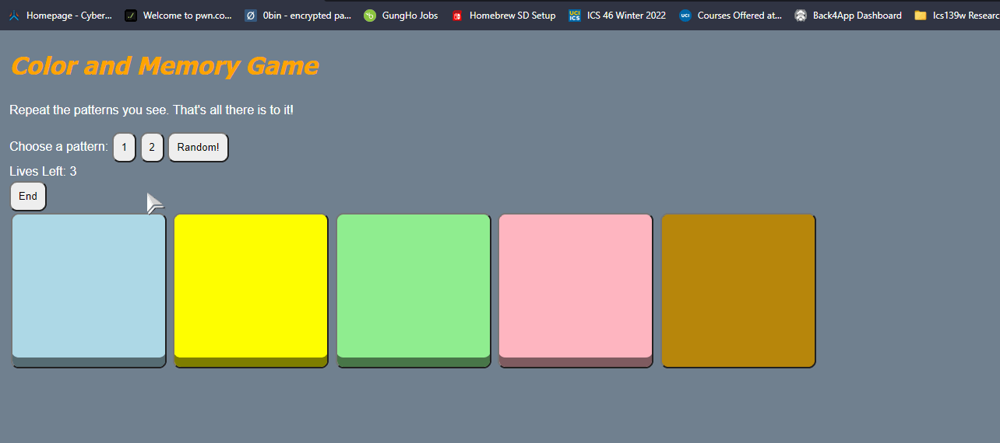

# Pre-work - *Memory Game*

**Memory Game** is a Light & Sound Memory game to apply for CodePath's SITE Program. 

Submitted by: **Abdelrahman Sallam**

Time spent: **4** hours spent in total

Link to project: https://invincible-gleaming-forsythia.glitch.me

## Required Functionality

The following **required** functionality is complete:

* [x] Game interface has a heading (h1 tag), a line of body text (p tag), and four buttons that match the demo app
* [x] "Start" button toggles between "Start" and "Stop" when clicked. 
* [x] Game buttons each light up and play a sound when clicked. 
* [x] Computer plays back sequence of clues including sound and visual cue for each button
* [x] Play progresses to the next turn (the user gets the next step in the pattern) after a correct guess. 
* [x] User wins the game after guessing a complete pattern
* [x] User loses the game after an incorrect guess

The following **optional** features are implemented:

* [x] Any HTML page elements (including game buttons) has been styled differently than in the tutorial
* [x] Buttons use a pitch (frequency) other than the ones in the tutorial
* [x] More than 4 functional game buttons
* [ ] Playback speeds up on each turn
* [ ] Computer picks a different pattern each time the game is played
        -I chose to let the user make that decision instead
* [x] Player only loses after 3 mistakes (instead of on the first mistake)
* [x] Game button appearance change goes beyond color (e.g. add an image)
*       -Used shadows to emulate "pressing down" on the button
* [ ] Game button sound is more complex than a single tone (e.g. an audio file, a chord, a sequence of multiple tones)
* [ ] User has a limited amount of time to enter their guess on each turn

The following **additional** features are implemented:

- [x] 2 different patterns are implemented, with buttons that allow users to choose between them
- [x] Random pattern generator is implemented, which allows users to make the pattern random

## Video Walkthrough (GIF)

If you recorded multiple GIFs for all the implemented features, you can add them here:

## Reflection Questions
1. If you used any outside resources to help complete your submission (websites, books, people, etc) list them here. 
    
    -https://developer.mozilla.org/en-US/docs/Web/JavaScript/Reference/Global_Objects/Math/random
    
    -https://www.w3schools.com/js/js_arrays.asp
    
    -https://www.w3schools.com/cssref/css_colors.asp
    
    -https://fdossena.com/?p=html5cool/buttons/i.frag
    
    -https://stackoverflow.com/questions/44916184/how-to-let-a-button-next-to-a-text

2. What was a challenge you encountered in creating this submission (be specific)? How did you overcome it? (recommended 200 - 400 words) 

The biggest challenge that I encountered in building out the memory game website was my inexperience with HTML, CSS, and JavaScript. It was difficult at first to manipulate the data structures and objects at first, as I am well versed in Python and C++, but I haven't really had any experience with these three languages before. I was mostly learning as I went along, which seems to happen often. The way I overcame this actually stemmed from my experience with other programming languages. In most situations I knew what it was that I wanted to do (loop through an array, choose random numbers in a range, etc), but I didn't know how what methods or functions to call to get it done. Of course, no problem is unique, especially the very basic ones I was having, so there was lots of documentation that matched what I needed (and things I would need later but didn't realize it yet). Since I was asking very specific questions, it was easy to get the answers to them online, and expand my experience in this new area at the same time. I used a similar approach in the CodePath Android Studio class that I took, in which we programmed in Kotlin. 

3. What questions about web development do you have after completing your submission? (recommended 100 - 300 words) 

Most of the work on our page was done by combining 1 HTML, CSS, and JavaScript file respectively, and I was wondering if there are solutions or langagues that combine these three into 1, as this seems like a lot of overhead. Another question I had pertains to having multiple pages. I assume each page would require a separate HTML, CSS and JavaScript file, but how do they "know" about eachother, and what lives on different pages. Other than that, everything is mostly clear so far.

4. If you had a few more hours to work on this project, what would you spend them doing (for example: refactoring certain functions, adding additional features, etc). Be specific. (recommended 100 - 300 words) 

I'd like to clean up my guess function to have less nested contitionals (maybe I could use switch cases or something). Other than that, I'd dive into adding custom files for the audio that plays from the buttons, and custom images for the buttons themselves. I have finals coming up, so I sadly couldn't dedicate the time to dive into those aspects just yet.

## Interview Recording URL Link

[My 5-minute Interview Recording](your-link-here)

## License

    Copyright [YOUR NAME]

    Licensed under the Apache License, Version 2.0 (the "License");
    you may not use this file except in compliance with the License.
    You may obtain a copy of the License at

        http://www.apache.org/licenses/LICENSE-2.0

    Unless required by applicable law or agreed to in writing, software
    distributed under the License is distributed on an "AS IS" BASIS,
    WITHOUT WARRANTIES OR CONDITIONS OF ANY KIND, either express or implied.
    See the License for the specific language governing permissions and
    limitations under the License.
